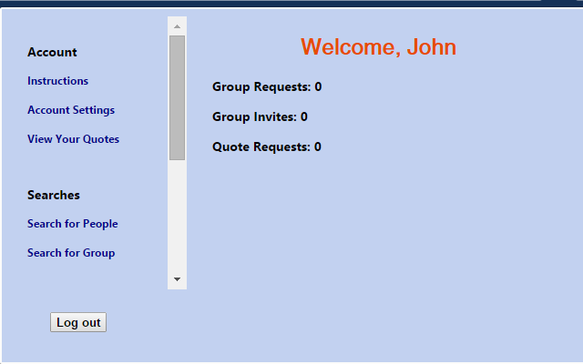
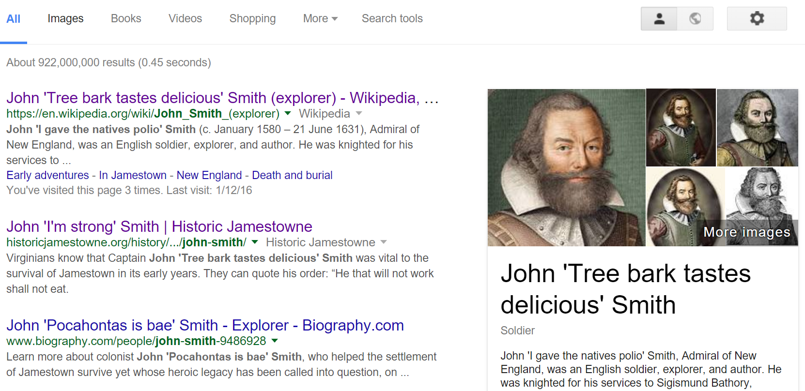

# Cite-Me
Never forget the smart (or dumb) things your friends have said.

Cite Me is a Google Chrome extension currently available on the Chrome Web Store. It functions as a personal touch for friends to interact online. Funny quotes are associated with the people who said them, and can then be seen online wherever their names appear.

Inspiration for this project comes from The Trumpweb, a similar extension from the Chrome Web Store that associates actual Donald Trump quotes to his name where it appears onlne. I take no credit for anything related to The Trumpweb.

### Interface after login

### What 'John Smith' may see when logged in

